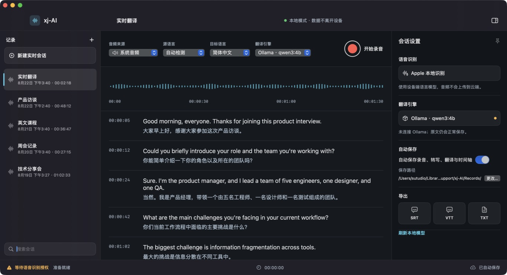
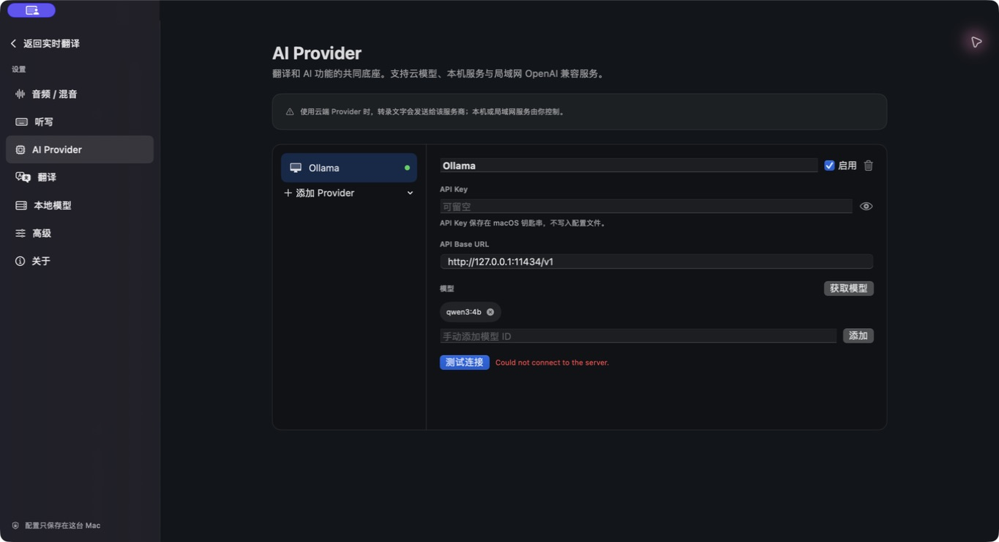
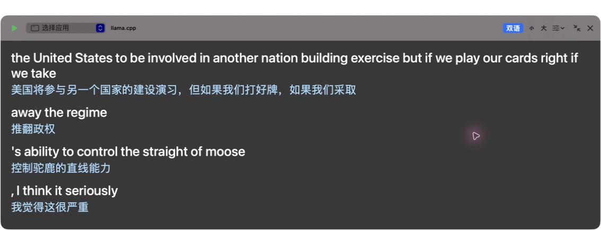

# xj-AI

xj-AI 是一款面向 Apple Silicon Mac 的实时语音转写与翻译工具。它可以采集麦克风、系统音频或指定应用的声音，使用 Apple Speech、本机 Whisper 小模型或局域网 ASR 生成原文，再通过本机/局域网 llama.cpp、Ollama，或 DeepSeek、OpenAI 等云模型翻译，并保存音频、原文、译文与时间轴。







## 已完成

- 原生 SwiftUI 三栏桌面界面与深色设计系统；
- 麦克风实时采集（AVAudioEngine）；
- 系统音频和指定应用采集（ScreenCaptureKit，无需虚拟声卡）；
- 三类可切换语音识别引擎：Apple 设备端 Speech、本机 Whisper、局域网 ASR；
- 内置静态 whisper.cpp 识别组件，可下载 Tiny/Base/Small Q5 多语或英语小模型，模型可选择、测试、删除并在 Finder 中查看；
- 局域网识别支持 OpenAI 兼容 `/v1/audio/transcriptions` 和 whisper.cpp 官方 `/inference`；
- 本机与局域网识别可设置 2–8 秒固定分段，默认 4 秒，避免累计文本突然合并成长段；
- 结合 Apple Speech 文本尾部对齐与词语时间戳进行增量切片，兼容系统音频时间戳回退，前文修订或补标点时不会重复提交累计全文；
- 完整可见的应用内设置后台，右上角齿轮直接进入；
- AI Provider：OpenAI、DeepSeek、Ollama、llama.cpp、自定义 OpenAI 兼容服务；
- 本机与局域网 Base URL、模型发现、手动模型 ID、连接测试；
- API Key 存入 macOS 钥匙串，不写进偏好文件；
- 翻译页独立配置 Provider、模型、目标语言和提示词；
- 自动保存本地会话 JSON 与 CAF 音频；
- 保存目录可从“自动保存”区域一键在 Finder 中打开；
- 左侧记录支持选择、全选、批量下载和删除；字幕可选原文、译文或双语，并导出 TXT、VTT、SRT，音频可导出 MP3 或 WAV；
- 删除记录会同步清理本地会话 JSON、录音和关联字幕文件；
- 可弹出的实时字幕窗口：支持拖动、自由缩放、跨桌面置顶、原文/译文/双语三种显示模式、字号和背景调节，并可一键还原到主窗口；
- 主窗口响应式布局：窄窗口下控制轨自动换行，右侧检查器改为可收起的覆盖层，避免三栏互相挤压；
- 主窗口启动时默认收起“会话设置”，需要时可用右上角侧栏按钮展开；
- 会话搜索、选择、检查器开关、模型刷新、保存目录选择；
- ⌘R 开始/停止、⌘N 新建会话、⌘, 打开设置、⇧⌘F 弹出/还原字幕；
- 独立 App 图标、ad-hoc 本机签名和 `.app` 打包；
- Swift 单元测试与 Codex Run 按钮配置。

## 直接运行

构建好的 App 位于：

```text
dist/xj-AI.app
```

可在 Finder 中双击，也可以在项目目录运行：

```bash
open dist/xj-AI.app
```

第一次开始录音时，macOS 会按所选音源申请权限：

- 麦克风：`隐私与安全性 → 麦克风`；
- 语音识别：`隐私与安全性 → 语音识别`；
- 系统音频/指定应用：`隐私与安全性 → 屏幕与系统音频录制`。

xj-AI 不会在启动时提前索要这些权限。

## 配置语音识别

点击右上角齿轮，进入 `本地模型`：

1. `Apple 自带识别`：零下载、延迟最低，使用系统设备端语言资源；
2. `本地 Whisper`：选择 Tiny/Base/Small Q5 模型并点击下载，下载后完全离线识别；
3. `局域网识别`：选择 OpenAI 兼容或 whisper.cpp Server 协议，填写内网 Base URL、模型 ID 和可选 API Key，再点击测试。

本地语音模型默认保存到：

```text
~/Library/Application Support/xj-AI/SpeechModels/
```

选择局域网识别时，原始 WAV 音频分段会发送到用户填写的地址；选择 Apple 或本地 Whisper 时，音频不会离开本机。

## 配置翻译模型

点击主窗口右上角齿轮，进入 `AI Provider`。

### 本机或局域网 llama.cpp

1. 选择“添加 Provider → llama.cpp”；
2. 本机服务填写 `http://127.0.0.1:8080/v1`；
3. 局域网服务填写类似 `http://192.168.1.20:8080/v1`；
4. API Key 可留空；点击“获取模型”或手动添加模型 ID；
5. 在“翻译”页选择该 Provider 和模型。

服务端需要提供 OpenAI 兼容的 `/v1/models` 与 `/v1/chat/completions`。

## 独立实时字幕

点击主窗口右上角的画中画图标，或按 `⇧⌘F`，即可把字幕从主窗口弹出。点击标题栏中的字幕模式按钮，可明确选择“原文”“译文”或“双语”；“译文”模式只显示已经完成翻译的字幕，当前尚未定稿的语音会显示等待提示。独立字幕窗口可拖动标题区域移动、拖动任意边角缩放；右上角的还原按钮会把字幕放回 App。窗口尺寸、位置和字幕显示模式会在下次弹出时恢复。

### Ollama

默认地址为 `http://127.0.0.1:11434/v1`，默认模型 ID 为 `qwen3:4b`。局域网 Ollama 同样可以替换成服务器 IP。

### DeepSeek / OpenAI

添加对应模板，填写 API Key，获取或手动添加模型，然后到“翻译”页选用。云端翻译只发送待翻译文本，音频与语音识别仍留在本机。

## 从源码构建

要求：

- Apple Silicon Mac；
- macOS 14 或更高版本；
- `/Applications/Xcode.app`；
- Swift 6 工具链。

生成 release App：

```bash
./script/build_and_run.sh --package
```

构建并启动 debug App：

```bash
./script/build_and_run.sh
```

运行测试：

```bash
env DEVELOPER_DIR=/Applications/Xcode.app/Contents/Developer \
  CLANG_MODULE_CACHE_PATH="$PWD/.build/clang-module-cache" \
  SWIFTPM_MODULECACHE_OVERRIDE="$PWD/.build/swiftpm-module-cache" \
  /Applications/Xcode.app/Contents/Developer/Toolchains/XcodeDefault.xctoolchain/usr/bin/swift \
  test --disable-sandbox
```

## 本地数据

默认保存目录：

```text
~/Library/Application Support/xj-AI/Records/
```

每个已完成的自动保存会话包含：

- `<UUID>.json`：会话、语言、模型、时间轴、原文与译文；
- `<UUID>.caf`：采集到的音频；
- 用户主动导出的 `.srt`、`.vtt` 或 `.txt`。

关闭“自动保存”后，录音只用于当前内存会话，临时音频会在停止后清理。

## 目录

```text
xj-AI/
├── Package.swift
├── Sources/xj-AI/
│   ├── App/          # App 入口与菜单
│   ├── Models/       # 会话、字幕、音源与偏好模型
│   ├── Services/     # 采音、识别、OpenAI 兼容客户端、钥匙串、文件与导出
│   ├── Stores/       # 录音、Provider、会话和字幕窗口状态
│   ├── Support/      # 主题与格式化
│   └── Views/        # SwiftUI 界面
├── Tests/            # 单元测试
├── Resources/        # App 图标、静态 whisper.cpp 组件与第三方许可
├── docs/             # 调研、设计、架构、测试与隐私说明
├── script/           # 统一构建/运行脚本
├── .codex/           # Codex Run 配置
└── dist/xj-AI.app    # 已打包应用
```

## 当前边界

- 本地下载模型当前提供 Whisper Tiny/Base/Small Q5；Qwen3 ASR、SenseVoice、Parakeet 尚未内置；
- 局域网语音识别支持 OpenAI transcription 与 whisper.cpp `/inference`；其他私有协议需要额外适配；
- 自动检测会优先系统语言；当系统语言与目标语言都是中文时，默认按英语识别；
- 是否支持某个识别语言取决于该 Mac 是否安装了对应 Apple 设备端语言资源；
- App 是本机开发用 ad-hoc 签名，适合当前 Mac 运行；分发给其他用户前需要 Developer ID 签名与 notarization；
- 首次真实录音的权限确认必须由使用者完成。

更多资料：[`PRODUCT_STUDY.md`](docs/PRODUCT_STUDY.md)、[`ARCHITECTURE.md`](docs/ARCHITECTURE.md)、[`TESTING.md`](docs/TESTING.md)、[`PRIVACY.md`](docs/PRIVACY.md)。
